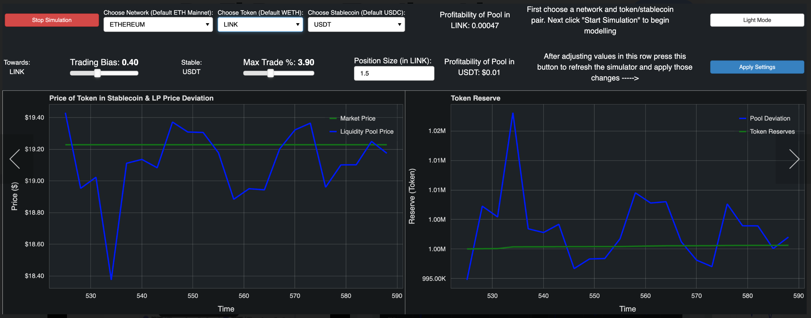

# UniswapPy: Uniswap V2 / V3 Analytics with Python
This package contains python re-factors of both original Uniswap [V2](https://github.com/Uniswap/v2-core/blob/master/contracts/UniswapV2Pair.sol) and [V3](https://github.com/Uniswap/v3-core/blob/main/contracts/UniswapV3Pool.sol)
pairing codes, and can be utilized for the purpose of analysing and modelling its behavior for DeFi. 

## Docs
Visit [docs](https://defipy.org) for full documentation with walk-through 
tutorials

## Installation 
```
> git clone https://github.com/defipy-devs/uniswappy
> pip install .
```
or
```
> pip install UniswapPy
```

## Uniswap V2

* See [test notebook](https://github.com/defipy-devs/uniswappy/blob/main/notebooks/tutorials/uniswap_v2.ipynb) 
for basic usage

```
from uniswappy import *

user_nm = 'user'
eth_amount = 1000
tkn_amount = 100000

tkn = ERC20("TKN", "0x111")
eth = ERC20("ETH", "0x09")
exchg_data = UniswapExchangeData(tkn0 = eth, tkn1 = tkn, symbol="LP", address="0x011")

factory = UniswapFactory("ETH pool factory", "0x2")
lp = factory.deploy(exchg_data)

Join().apply(lp, user_nm, eth_amount, tkn_amount)
lp.summary()
```

#### OUTPUT:
Exchange ETH-TKN (LP) <br/>
Reserves: ETH = 1000, TKN = 100000 <br/>
Liquidity: 10000.0 <br/><br/> 

```
out = Swap().apply(lp, tkn, user_nm, 1000)
lp.summary()
```

#### OUTPUT:
Exchange ETH-TKN (LP) <br/>
Reserves: 990.1284196560293, TKN = 101000 <br/>
Liquidity: 10000.0 <br/><br/> 


## Uniswap V3

* See [test notebook](https://github.com/defipy-devs/uniswappy/blob/main/notebooks/tutorials/uniswap_v3.ipynb) 
for basic usage

```
from uniswappy import *

user_nm = 'user'
eth_amount = 1000
tkn_amount = 100000

eth = ERC20("ETH", "0x09")
tkn = ERC20("TKN", "0x111")

exchg_data = UniswapExchangeData(tkn0 = eth, tkn1 = tkn, symbol="LP", 
                                   address="0x011", version = 'V3', 
                                   tick_spacing = tick_spacing, 
                                   fee = fee)

factory = UniswapFactory("ETH pool factory", "0x2")
lp = factory.deploy(exchg_data)

out_v3 = Join().apply(lp, user_nm, eth_amount, tkn_amount, lwr_tick, upr_tick)
lp.summary()
```

#### OUTPUT:
Exchange ETH-TKN (LP) <br/>
Reserves: ETH = 1000, TKN = 100000 <br/>
Liquidity: 10000.0 <br/><br/> 

```
out = Swap().apply(lp, tkn, user_nm, 1000)
lp.summary()
```

#### OUTPUT:
Exchange ETH-TKN (LP) <br/>
Real Reserves: ETH = 990.1284196560293, TKN = 101000 <br/>
Liquidity: 10000.0 <br/><br/> 


## 0x Quant Terminal

This application utilizes the 0x API to produce a mock Uniswap pool which allows end-users to stress test
the limitations of a Uniswap pool setup using live price feeds from [0x API](https://0x.org); for backend setup, see 
[notebook](https://github.com/defipy-devs/uniswappy/blob/main/notebooks/tutorials/quant_terminal.ipynb) 

Click [dashboard.defipy.org](https://dashboard.defipy.org/) for live link; for more detail see 
[README](https://github.com/defipy-devs/uniswappy/tree/main/python/application/quant_terminal#readme) 



### Run application locally  

```
> bokeh serve --show python/application/quant_terminal/bokeh_server.py
```

## Special Features
 * **Abstracted Actions**: Obfuscation is removed from standard Uniswap 
action events to help streamline analysis and lower line count; see 
article [How to Handle Uniswap Withdrawals like an 
OG](https://medium.com/coinmonks/handle-uniswap-withdrawals-like-an-og-389fe74be18c), 
and [Setup your Uniswap Deposits like a 
Baller](https://medium.com/coinmonks/setup-your-uniswap-deposits-like-a-baller-b99340ea302f)
 * **Indexing**: Can calculate settlment LP token amounts given token 
amounts and vice versa; see article [The Uniswap Indexing 
Problem](https://medium.com/datadriveninvestor/the-uniswap-indexing-problem-8078b8b110fc)
 * **Simulation**: Can simulate trading using Geometric Brownian Motion 
(GBM) process, or feed in actual raw price data to analyze behavior; see 
article [How to Simulate a Liquidity Pool for Decentralized 
Finance](https://medium.com/@icmoore/simulating-a-liquidity-pool-for-decentralized-finance-6f357ec8564b)
 * **Randomized Events**: Token amount and time delta models to simulate 
possible trading behavior
 * **Analytical Tools**: Basic yeild calculators and risk tools to assist 
in analyzing outcomes; see 
article [How to Simulate a Uniswap V3 Order Book in Python](https://medium.com/datadriveninvestor/how-to-simulate-a-uniswap-v3-order-book-in-python-149480d12305)

If you find this package helpful, please leave a ⭐!
 
 

